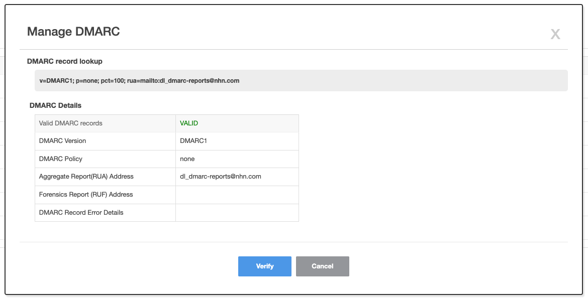
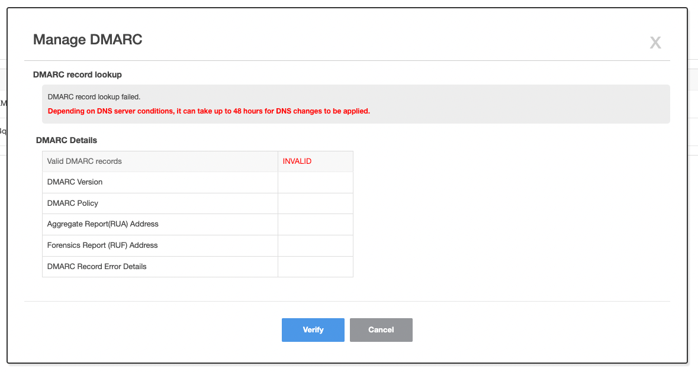

<!-- pre-align:aligned sig=35410de2bf8a -->

<a id="notification-email-domain-management-guide-dmarc"></a>
## Notification > Email > Domain Management Guide > DMARC { #notification-email-domain-management-guide-dmarc }

<a id="what-is-dmarc-domain-based-message-authentication-reporting-and-conformance"></a>
### What is DMARC (domain-based message authentication reporting and conformance)? { #what-is-dmarc-domain-based-message-authentication-reporting-and-conformance }

DMARC, the last step in enabling enhanced email security, is the reporting and compliance policy for domain-based message authentication to prevent phishing and
fraud using email spoofing.
<br>Receiving server lookups DMARC record in DNS of the sender address (From) domain. According to the policy defined in DMARC record, receiving server
authenticates receiving mail. DMARC policy consists of using SPF and DKIM and what happens to mail processing when each authentication method fails.
<br>Some mail services (ex. Gmail, Yahoo, etc.) recognize DMARC as spam and block delivery if DMARC not applied. We recommend using DMARC records for higher
delivery rate between mail deliveries.

<a id="record-structure-of-dmarc-dns"></a>
### Record Structure of DMARC DNS { #record-structure-of-dmarc-dns }

DMARC DNS record registers the record in the sub-domain DNS with '_dmarc' in sender domain to the DMARC to be applied, such as '_dmarc.example.com.'

Following is an example of a DMARC DNS record.

``` 
"v=DMARC1;p=none;sp=quarantine;pct=100;rua=mailto:dmarcreports@example.com;" 
```

Describes the values used for DMARC records. For more information, please refer to [RFC 7489](https://www.ietf.org/rfc/rfc7489.txt).

| Classification | Required | Value | Description                                                                                                            |
| --- | ----- |----------------------|-------------------------------------------------------------------------------------------------------------------------------------------------------------------------------------------------------|
| v | Required | DMARC1 (Fixed) | Version.                                                                                                               |
| p | Required | None, quarantine, reject | Policy for handling failure.                                                                                           |
| sp | Optional | None, quarantine, reject | Failure handling policy for subdomains.                                                                                |
| pct | Optional | 0 \~ 100 (default 100) | The proportion of emails to which the policy to be applied. For example, if it is 50, half of the emails received
will be authenticated by DMARC policy. |
| adkim | Optional | s, r (default) | DKIM Alignment. Setting for matching level of DKIM-Signature domain (d) and From (5322.From).                          |
| aspf | Optional | s, r (default) | SPF Alignment. Setting for the matching level of MAIL FROM (5321.From) and From (5322.From) during SPF authentication. |
| rua | Optional | |                                                                                                                        | Address to receive periodically aggregated failure reports. Example, mailto:demarc-report@nhncloud.com |
| ruf | Optional | |                                                                                                                        | | Address to receive the failure report. Example, mailto:demarc-report@nhncloud.com |
| fo | Optional | 0 (default), 1, d, s | Criteria to generate a failure report (ruf).                                                                           |
| rf | Optional | afrf (fixed) | Setup for the failure report (ruf) format.                                                                             |
| ri | Optional | 86400 (default value, in seconds) | Period to count failures. A failure report (rua) is sent every set period.                                             |

<a id="record-structure-of-dmarc-dns-failure-policy-p-value-type"></a>
#### Failure policy (p) value type

| Failure Policy | Description | 
| ----- |-----------------------------------------------------------------------------------------------------------------------------| 
| none | I hope the receiving server won't do anything about the failure. You can set it up in situations where SPF and DKIM are not used. | 
| quarantine | Receiving server wants to spam failed mails. | 
| reject | Return DMARC failed mail from the receiving server. Typically, the sender servers and receiving servers prefer the policy of status notification (DSN) responses during SMTP communication. |

<a id="record-structure-of-dmarc-dns-description-of-spf-and-dkim-alignment-aspf-adkim-values"></a>
#### Description of SPF and DKIM alignment (aspf, adkim) values

| Policy | Description | 
| --- |------------------------------------------------------------------------------------------------- | 
| s | Strict. The domain part must match completely. | 
| r | Flexible (Relaxed). Also available with subdomains. For example, when 'd=example.com,' 'From: news.example.com' passes |

<a id="description-of-values-for-criteria-fo-of-failure-report-generation"></a>
### Description of values for Criteria (fo) of failure report generation { #description-of-values-for-criteria-fo-of-failure-report-generation }

- It is used when set up a failure report (ruf).

| Criteria | Description | 
| --- | --- | 
| 0 | Report when both SPF and DKIM fail. | 
| 1 | Report when either SPF or DKIM fails. | 
| d | Report when DKIM authentication failure. | 
| s | Report when SPF authentication fails |

<a id="dmarc-record-certification-procedure"></a>
### DMARC record certification procedure { #dmarc-record-certification-procedure }

<a id="dmarc-record-certification-procedure-mail-domain-registration-and-authentication"></a>
#### 1. Mail Domain Registration and Authentication

- DMARC record certification is enabled on web console when the mail domain is registered and authenticated.
- For detailed guide on mail domain authentication, refer
  to [Notification > Email > Domain Management Guide > Domain Authentication and Protection](./domain-verification/)
  .

<a id="dmarc-record-certification-procedure-dmarc-record-dns-registration"></a>
#### 2. DMARC Record DNS Registration

- Describes how to register DMARC record. Contact your DNS administrator for more information on how to register.
- DMARC records have to register domain DNS with '_dmarc' in sender domain to which DMARC to be applied, such as '_dmarc.example.com' and establish the
  appropriate DMARC policy to register it as a TXT record.
- For example, the following is what you need to register. You have to set the address to receive the report, if DMARC fails.

``` 
"v=DMARC1; p=none; fo=1; rua=mailto:${ address_to_receive_report }" 
```

- Once registration is complete, you can use the 'nslookup' and 'dig' commands to see if the DMARC DNS records have been reflected in DNS.

<a id="dmarc-record-certification-procedure-precautions"></a>
#### Precautions

- Even if you finish changing DMARC settings for TXT record, it will take up to 48 hours for DNS changes to take effect depending on DNS server situation.
- It is safe to send an email in a few hours after DMARC setup.

<a id="dmarc-record-certification-procedure-dmarc-authentication"></a>
#### 3. DMARC Authentication

- When DMARC record DNS registration is complete, perform DMARC authentication in DMARC administration pop-up.
- When authentication is complete, the phrase **Authenticated** is displayed.
  

<a id="dmarc-record-certification-procedure-example-of-dmarc-record-lookup-failure-screen"></a>
#### Example of DMARC record lookup failure screen

- If DMARC record lookup fails, the following screen is displayed.



<a id="precautions"></a>
### Precautions { #precautions }

<a id="precautions-spf-related-guidelines"></a>
#### 1. SPF-related Guidelines

When referencing [RFC 7489](https://www.ietf.org/rfc/rfc7489.txt) document, some receiving servers may first implement DMARC authentication logic for SPF. DMARC
authentication may fail if SPF record has a prefix - such as all. If DMARC authentication fails on some receiving servers, remove the prefix - such as all – in
SPF record and try DMARC authentication again.

<a id="precautions-dmarc-related-guidelines"></a>
#### 2. DMARC-related Guidelines

Note that DMARC does not fully guarantee that receiving server will handle it in accordance with DMARC policy. DMARC should be understood as the level at which
the sending server proposes a policy to the receiving server.
For example, even though failure policy was set to 'none', the receiving server still spam emails that fail authentication.

NHN Cloud performs DMARC authentication in accordance with document [RFC 7489](https://www.ietf.org/rfc/rfc7489.txt). If some receiving servers fail to receive
mail, contact [Customer Center > 1:1 Enquiry](https://www.nhncloud.com/kr/support/inquiry).

