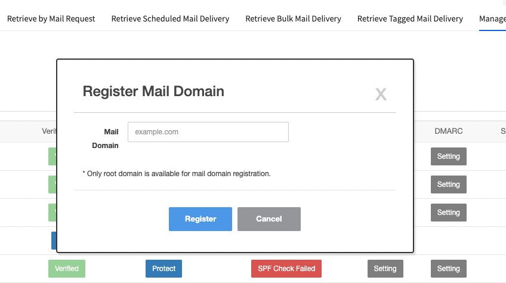
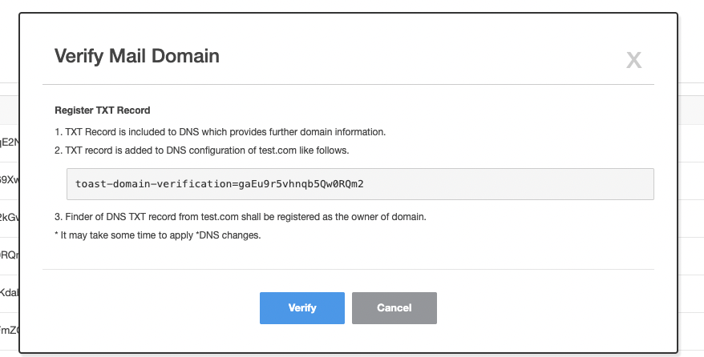
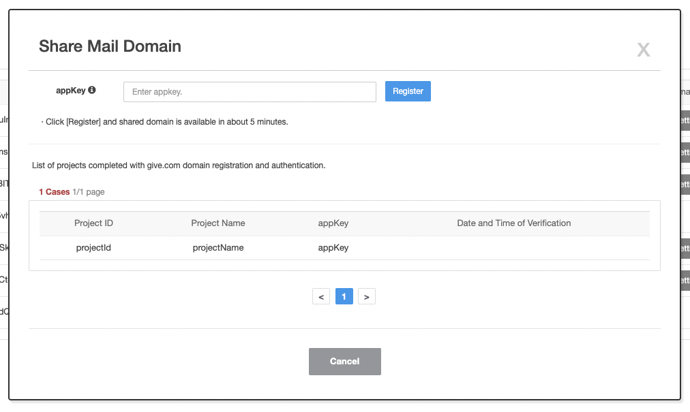
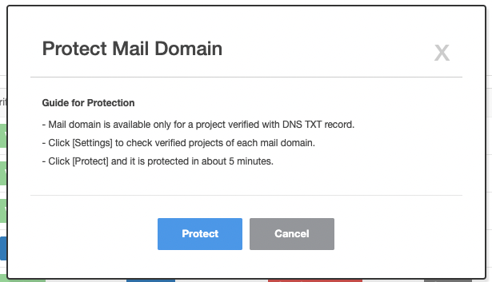

<!-- pre-align:aligned sig=b7204b882613 -->

<a id="notification-email-domain-management-guide-domain-authentication-and-protection"></a>
## Notification > Email > Domain management Guide > Domain Authentication and Protection { #notification-email-domain-management-guide-domain-authentication-and-protection }

<a id="enhanced-email-security-feature"></a>
### Enhanced email security feature { #enhanced-email-security-feature }

<a id="enhanced-email-security-feature-enhanced-mail-domain-protection-feature"></a>
#### Enhanced mail domain protection feature

Mail domain protection is a security feature provided by NHN Cloud Email. It prevents third parties from using the mail domain you own within the NHN Cloud
Email.
<br> Once you registered the mail domain on NHN Cloud Email console and confirm that you own it, other projects that are not approved would not be able to send
emails using that mail domain.

<a id="register-mail-domains-and-verify-ownership"></a>
### Register mail domains and verify ownership { #register-mail-domains-and-verify-ownership }

- First, you need to register your mail domain on NHN Cloud Email console and verify your ownership of mail domain.
- Mail domain owner registers TXT record provided by NHN Cloud Email to mail domain DNS.
- NHN Cloud Email checks ownership by matching TXT records in mail domain DNS.

<a id="mail-domain-authentication-and-protection-procedures"></a>
### Mail domain authentication and protection procedures { #mail-domain-authentication-and-protection-procedures }

<a id="mail-domain-authentication-and-protection-procedures-register-mail-domain"></a>
#### Register mail domain



1. Navigate to email console.
2. Navigate to **Manage Mail Domain** tab.
3. Click **Register Mail Domain** button and register the domain to use when sending mail. (Only the highest domain can be registered)

<a id="mail-domain-authentication-and-protection-procedures-mail-domain-authentication-ownership-verification-procedure"></a>
#### Mail domain authentication (ownership verification procedure)



1. Click **Authentication**. Created token is displayed in **Mail Domain Authentication** pop-up screen.
2. Add TXT record to the registered mail domain DNS.
3. If the added TXT record is reflected, click on **Authenticate** to verify the ownership of mail domain.
4. Like SPF, you can use the 'nslookup' and 'dig' commands to see if TXT record for ownership verification has been reflected in mail domain DNS.

<a id="mail-domain-authentication-and-protection-procedures-how-to-check-txt-record-in-dns"></a>
#### How to check TXT record in DNS

Linux environment

``` 
nslookup -q=TXT <your.domain.name> 
```

``` 
dig -t TXT <your.domain.name> 
```

Windows environment

```
nslookup -q=TXT <your.domain.name> 
```

<a id="sharing-domains"></a>
### Sharing Domains { #sharing-domains }

- Before protecting mail domains, if you are using a domain that is registered for another project, you need to share the domain.
- If you enable domain protection without sharing, sending mail from an unshared project fails. Therefore, you must share the mail domain if using it for
  multiple projects.

<a id="share-domains"></a>
### Share Domains { #share-domains }



1. Click **Share>Settings** button for the mail domain item you registered.
2. Navigate to the project you want to share and check NHN Cloud Email app key. Register the verified app key. When the sharing is complete, project information
   appears in the list. Appkey can be found in the top right corner **URL and Appkey**.

<a id="protecting-mail-domains"></a>
### Protecting Mail Domains { #protecting-mail-domains }



The protection is automatically activated when the mail domain is registered and ownership is verified. If you don't want to activate the protection, you can disable the feature manually.

1. Click **Protection Status > Protect** for the mail domain item for which you want to enable protection feature.
2. **Apply Protection Guide**, click on **Protect** to activate the feature.
3. Once activated, mail domain protection is complete, and that mail domain is not available to other projects during delivery.

[Caution]
The domain protection feature is applied on a domain basis. Once deactiveated, the protection feature is turned off in all the projects that verified the domain.

