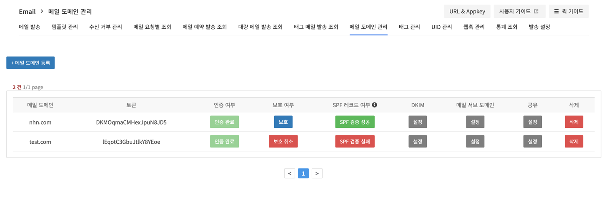

## Notification > Email > 도메인 관리 가이드 > SPF

### SPF(Sender Policy Framework)란?
- SPF는 이메일 발송자의 신뢰성을 검증하기 위한 메커니즘으로, 이메일 서버가 특정 도메인에서 발송된 메일이 실제로 허가된 서버에서 왔는지 확인합니다.
- 메일 발송간 발신자의 DNS에 등록된 SPF 레코드를 확인하여 SPF 레코드에 등록되지 않은 IP 주소에서 보낸 메일을 스팸메일로 처리할 수 있습니다.


### SPF 레코드 인증 절차 

#### 1. 메일 도메인 등록 및 인증 
SPF 레코드 검증은 메일 도메인이 등록 및 인증 완료되었을 경우 웹 콘솔에서 활성화됩니다. 
메일 도메인 인증 관련 상세 가이드는 [Notification > Email > 도메인 관리 가이드 > 도메인 인증 및 보호](https://docs.toast.com/ko/)를 참고하시기 바랍니다.

#### 2. NHN Cloud SPF 레코드 설정
아래의 값을 DNS의 TXT 레코드에 등록합니다. 자세한 등록 방법은 DNS 관리 업체에 문의하시기 바랍니다.

```
v=spf1 include:_spfblocka.toast.com ~all
```

TXT 레코드의 SPF 설정 변경 작업이 끝나더라도 DNS 서버 상황에 따라 DNS 변경 내용이 적용되기까지 최대 48시간이 소요됩니다.
<br> SPF 설정 변경 작업 후, 몇 시간 정도 지난 다음에 이메일을 발송하는 것이 안전합니다.

#### 3. SPF 레코드 검증
인증 완료한 도메인의 SPF 레코드가 정상적으로 등록되었는지 확인합니다.
등록이 완료되었을 경우 `SPF 검증 성공` 메시지가 표시됩니다.



### 주의사항
[RFC 4408](https://datatracker.ietf.org/doc/rfc4408/?include_text=1)의 Section 10.1 "Processing Limits"에는 DNS Lookup간 처리 규약이 명시되어 있습니다.

> SPF implementations MUST limit the number of mechanisms and modifiers that do DNS lookups to at most 10 per SPF check, including any lookups caused by the use of the "include" mechanism or the "redirect" modifier. If this number is exceeded during a check, a PermError MUST be returned. The "include", "a", "mx", "ptr", and "exists" mechanisms as well as the "redirect" modifier do count against this limit. The "all", "ip4", and "ip6" mechanisms do not require DNS lookups and therefore do not count against this limit. The "exp" modifier does not count against this limit because the DNS lookup to fetch the explanation string occurs after the SPF record has been evaluated.

해당 호출에는 "include" 메커니즘이나 "redirect" 수정자에 의해 트리거된 모든 조회가 포함됩니다. NHN Cloud Email의 spf 레코드 `v=spf1 include:_spfblocka.toast.com ~all`가 DNS Lookup간 처리 규약을 초과할 경우, 스팸 메일로 처리될 수 있습니다.


